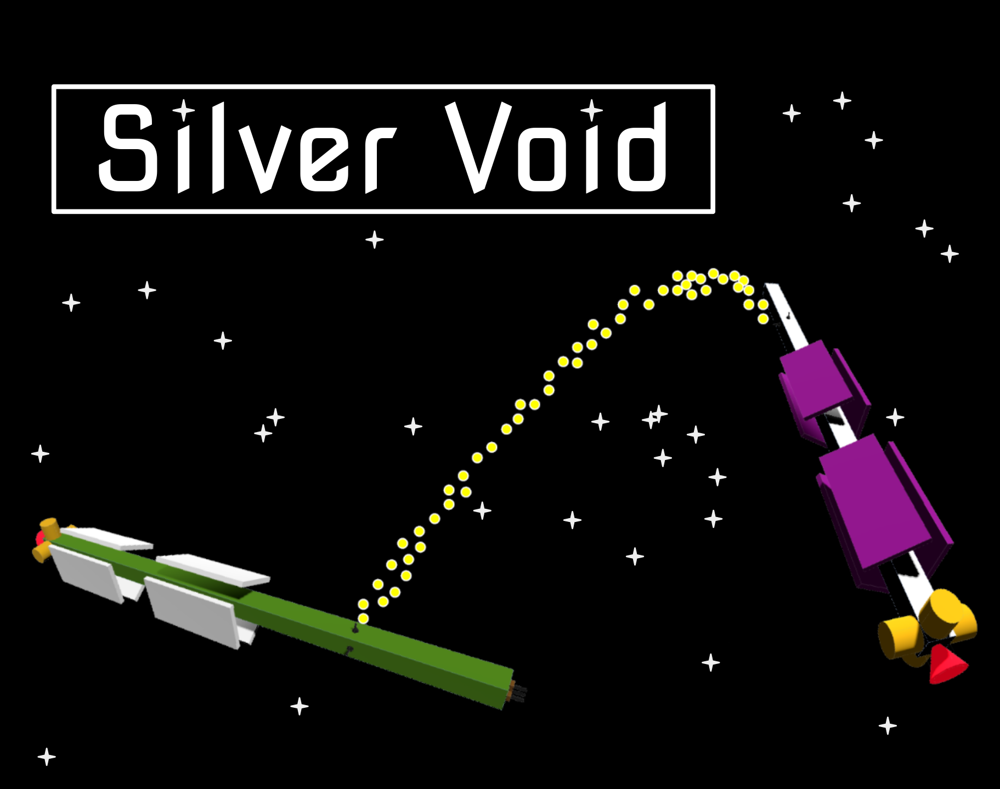

# Silver Void

A realistic-physics space shooter where you and a fleet of ships battle against an opposing fleet.

Made for Acerola Jam 0 (theme "Aberration"), enemies lead their shots so that bullets will hit where you are going to be, unless you continually thrust onto a new trajectory.

## Controls
### Flight

*left* / *right* - yaw

*up* / *down* - pitch

*q* / *e* - roll

*w* / *s* - translate forward/backward

*a* / *d* - translate left/right

*shift* / *ctrl* - translate up/down

*space* - shoot

### Misc
*f* - toggle fullscreen/windowed mode

*enter* - toggle HUD active/disabled

## Play/Download
See itch.io page: [https://dsamson.itch.io/silver-void](https://dsamson.itch.io/silver-void)

